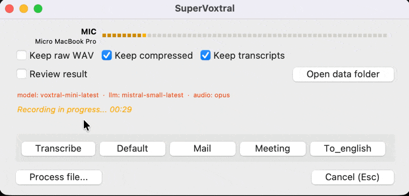
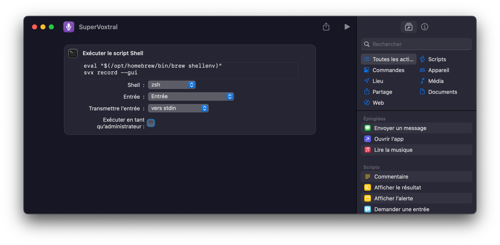

# supervoxtral



SuperVoxtral is a lightweight Python CLI/GUI utility for recording microphone audio and integrate with Mistral's Voxtral APIs for transcription or audio-enabled chat.

Voxtral models, such as `voxtral-mini-latest` and `voxtral-small-latest`, deliver fast inference times, high transcription accuracy across languages and accents, and minimal API costs. Voxtral supports two modes: pure transcription via a dedicated endpoint (no prompts needed) or chat mode, where audio input combines with text prompts for refined outputs—like error correction or contextual summarization—without invoking a separate LLM.

For instance, use a prompt like: "_Transcribe this audio precisely and remove all minor speech hesitations: "um", "uh", "er", "euh", "ben", etc._"

The GUI is minimal, launches fast, and can be bound to a system hotkey. Upon stopping recording, it transcribes via the pipeline and copies the result directly to the system clipboard, enabling efficient voice-driven workflows: e.g., dictating code snippets into an IDE or prompting LLMs via audio without typing.

## Requirements

- Python 3.11+
- ffmpeg (for MP3/Opus conversions)
  - macOS: `brew install ffmpeg`
  - Ubuntu/Debian: `sudo apt-get install ffmpeg`
  - Windows: https://ffmpeg.org/download.html

## Installation

The package is available on PyPI. We recommend using `uv` (a fast Python package installer) for a simple, global tool installation—no virtual environment setup required.


- For GUI support (includes PySide6):
  ```
  uv tool install "supervoxtral[gui]"
  # to update: uv tool update "supervoxtral[gui]"
  ```

- For core CLI only functionality:
  ```
  uv tool install supervoxtral
  ```

This installs the `svx` command globally. If you don't have `uv`, install it first via `curl -LsSf https://astral.sh/uv/install.sh | sh` (or from https://docs.astral.sh/uv/getting-started/installation/).

**Alternative: Using pip with a virtual environment**

If you prefer not to use uv, you can install via pip in a virtual environment:

1. Create and activate a virtual environment:

   - macOS/Linux:
     ```
     python -m venv .venv
     source .venv/bin/activate
     ```

   - Windows (PowerShell):
     ```
     python -m venv .venv
     .\.venv\Scripts\Activate.ps1
     ```

2. Install the package:

   For GUI support (includes PySide6):
   ```
   pip install "supervoxtral[gui]"
   ```

This installs the `svx` command within the virtual environment. Make sure to activate the environment before running `svx`.

**For development** (local editing):
1. Clone the repo and navigate to the project root.
2. Create/activate a virtual environment:
   - macOS/Linux: `python -m venv .venv && source .venv/bin/activate`
   - Windows: `python -m venv .venv && .\.venv\Scripts\Activate.ps1`
3. Install in editable mode: `pip install -e .` (or `pip install -e ".[dev]"` for dev tools).

## Quick Start

To get started quickly with SuperVoxtral:

1. Initialize the configuration: `svx config init`
   This creates the default `config.toml` file with zero-footprint settings.

2. Open the configuration directory: `svx config open`
   Edit `config.toml` and add your [Mistral API key](https://console.mistral.ai/api-keys) under the `[providers.mistral]` section:
   ```
   [providers.mistral]
   api_key = "your_mistral_api_key_here"
   ```

3. Launch the GUI: `svx record --gui`
   This opens the minimal GUI, starts recording immediately; click 'Transcribe' for pure transcription (no prompt) or a button for each configured prompt (e.g., 'Default', 'Mail', 'Translate') for prompted transcription using the selected prompt; --transcribe ignored with warning (results copied to clipboard).

### macOS Shortcuts Integration

To enable fast, hotkey-driven access on macOS, integrate SuperVoxtral with the Shortcuts app. Create a new Shortcut that runs `svx record --gui` via a "Run Shell Script" action (ensure `svx` is in your PATH). Assign a global hotkey in Shortcuts settings for instant GUI launch—ideal for quick voice-to-text workflows, with results copied directly to the clipboard.

#### Quick Setup Steps
1. Open the Shortcuts app and create a new shortcut.
2. Add the "Run Shell Script" action with input: `svx record --gui`.
3. In shortcut details, set a keyboard shortcut (e.g., Cmd+Shift+V).



## Configuration (API keys and prompts)

API keys and default behavior are configured only in your user configuration file (config.toml), not via environment variables.

- Location of the user config:
  - macOS: ~/Library/Application Support/SuperVoxtral/config.toml
  - Linux: ${XDG_CONFIG_HOME:-~/.config}/supervoxtral/config.toml
  - Windows: %APPDATA%/SuperVoxtral/config.toml

- Initialize your user config and user prompt file:
  - `svx config init`: Creates config.toml (with sensible defaults, including zero-footprint mode) and a user prompt file at: `~/Library/Application Support/SuperVoxtral/` (macOS), `${XDG_CONFIG_HOME:-~/.config}/supervoxtral/` (Linux), or `%APPDATA%/SuperVoxtral/prompt/` (Windows).
  - `svx config open`: Opens the directory.
  - `svx config show`: Displays the current configuration.

Here's an example of the default `config.toml` generated by `svx config init`:

```toml
# SuperVoxtral - User configuration
#
# Basics:
# - This configuration controls the default behavior of `svx record`.
# - The parameters below override the binary's built-in defaults.
# - You can override a few options at runtime via the CLI:
#   --prompt / --prompt-file (set a one-off prompt for this run)
#   --log-level (debugging)
#   --outfile-prefix (one-off output naming)
#
# Output persistence:
# - Set keep_* = true to create and save files to project
#   directories (recordings/, transcripts/, logs/).
# - false (default): use temp files/console only (no disk
#   footprint in project dir).
#
# Authentication:
# - API keys are defined in provider-specific sections in this file.
[providers.mistral]
# api_key = ""

[defaults]
# Provider to use (currently supported: "mistral")
provider = "mistral"

# File format sent to the provider: "wav" | "mp3" | "opus"
# Recording is always WAV; conversion is applied if "mp3" or "opus"
format = "opus"

# Model to use on the provider side (example for Mistral Voxtral)
model = "voxtral-mini-latest"

# Language hint (may help the provider)
language = "fr"

# Audio recording parameters
rate = 16000
channels = 1
device = ""

# Output persistence:
# - keep_audio_files: false uses temp files (no recordings/ dir),
#   true saves to recordings/
keep_audio_files = false
# - keep_transcript_files: false prints/copies only (no
#   transcripts/ dir), true saves to transcripts/
keep_transcript_files = false
# - keep_log_files: false console only (no logs/ dir), true
#   saves to logs/app.log
keep_log_files = false

# Automatically copy the transcribed text to the system clipboard
copy = true

# Log level: "DEBUG" | "INFO" | "WARNING" | "ERROR"
log_level = "INFO"

[prompt.default]
# Default user prompt source:
# - Option 1: Use a file (recommended)
file = "~/.config/supervoxtral/prompt/user.md"
#
# - Option 2: Inline prompt (less recommended for long text)
# text = "Please transcribe the audio and provide a concise summary in French."

[prompt.test]
# Example additional prompt
# file = "/path/to/another_prompt.md"
# text = "Summarize the meeting in bullet points."
```

**Configuration is centralized via a structured `Config` object loaded from your user configuration file (`config.toml`). CLI arguments override select values (e.g., prompt, log level), but most defaults (provider, model, keep flags) come from `config.toml`. No environment variables are used for API keys or settings.**

No `.env` or shell environment variables are used for API keys.


## Usage (CLI)

The CLI provides config utilities and a unified `record` entrypoint for both CLI and GUI modes, using a centralized pipeline for consistent behavior (recording, conversion, transcription, saving, clipboard copy, logging).

**Zero-footprint defaults**: No directories created; outputs to console/clipboard. Use `--save-all` or set `keep_* = true` in config.toml for persistence.

Most defaults (provider, format, model, language, rate, channels, device, keep flags, copy) come from config.toml. CLI overrides are limited to specific options.

### Record Command

```
svx record [OPTIONS]
```

**Options**:
- `--user-prompt TEXT` (or `--prompt TEXT`): Inline user prompt for this run.
- `--user-prompt-file PATH` (or `--prompt-file PATH`): Path to a markdown file with the user prompt.
- `--transcribe`: Enable pure transcription mode (ignores prompts; uses dedicated endpoint).
- `--outfile-prefix PREFIX`: Custom prefix for output files (default: timestamp).
- `--gui`: Launch the GUI frontend (interactive: recording starts immediately; buttons 'Transcribe' (pure, no prompt) or 'Prompt' (with resolved prompt); respects config and other CLI options; --transcribe ignored with warning).
- `--save-all`: Override config to keep audio, transcripts, and logs for this run.
- `--log-level LEVEL`: Set logging level (DEBUG, INFO, WARNING, ERROR; default: INFO).

**Examples**:
- Record with prompt: `svx record --prompt "What's in this audio?"`
  - Records WAV, converts if needed, sends to provider with prompt, outputs to console/clipboard.
- Persist outputs: `svx record --save-all --prompt "Summarize this"`
  - Saves to recordings/, transcripts/, logs/.
- Transcribe only: `svx record --transcribe`
  - No prompt; direct transcription. Add `--save-all` to persist.
- Launch GUI: `svx record --gui`
  - Interactive mode: recording starts immediately; click 'Transcribe' (pure transcription, no prompt) or 'Prompt' (with resolved prompt); --transcribe ignored with warning. GUI respects config.toml and CLI flags (e.g., `--gui --save-all`).

**Prompt Resolution Priority** (for non-transcribe mode):
By default in CLI, uses the 'default' prompt from config.toml [prompt.default]. For overrides:
1. CLI `--user-prompt` or `--user-prompt-file`
2. Specified prompt key (future: via --prompt-key; currently implicit 'default')
3. config.toml [prompt.default] (text or file)
4. User prompt file (user.md in config dir)
5. Fallback: "What's in this audio?"

## Changelog

- 0.1.5: Fix bug on prompt selecting
- 0.1.4: Support for multiple prompts in config.toml with dynamic GUI buttons for each prompt key
- 0.1.3: Minor style update
- 0.1.2: Interactive mode in GUI (choose transcribe / prompt / cancel while recording)
- 0.1.1: Minor updates to default config and default prompt

## License

MIT
