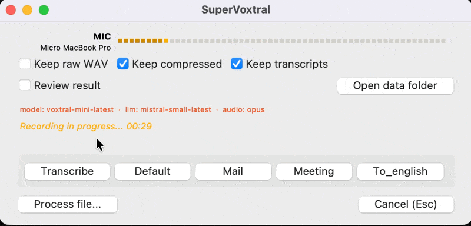
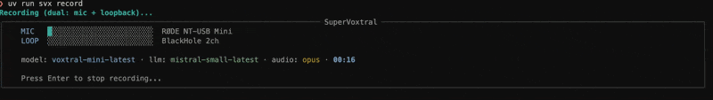
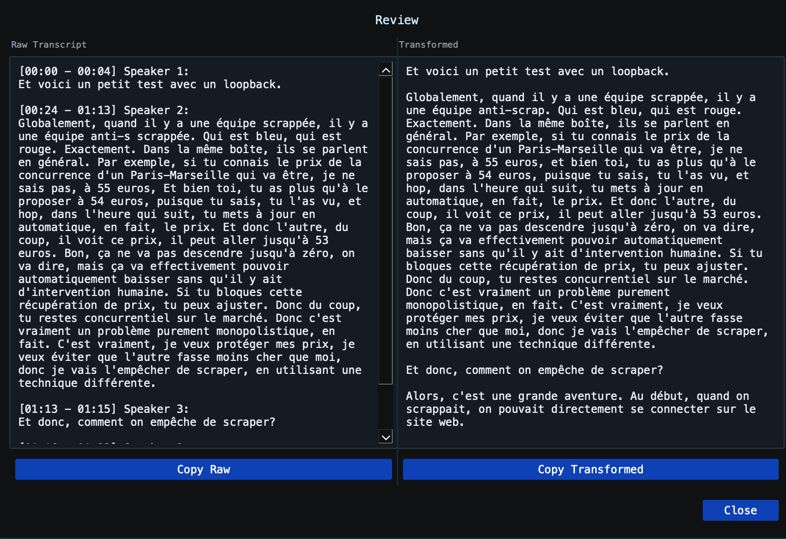
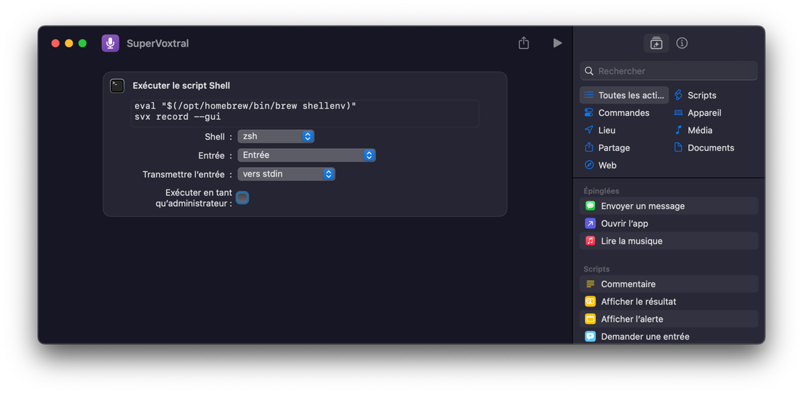

# supervoxtral

**GUI**:



**CLI**:



SuperVoxtral is a lightweight Python CLI/GUI utility for recording audio and processing it via a 2-step pipeline using Mistral's APIs.

The pipeline works in two stages:
- (1) **Transcription** — audio is converted to text using Voxtral's dedicated transcription endpoint (`voxtral-mini-latest`), which delivers fast inference, high accuracy across languages, and minimal API costs;
- (2) **Transformation** — the raw transcript is refined by a text-based LLM (e.g., `mistral-small-latest`) using a configurable prompt for tasks like error correction, summarization, or reformatting.

In pure transcription mode (`--transcribe`), only step 1 is performed.

**Key features:**
- **Process existing files** — feed any audio or video file (WAV, MP3, M4A, FLAC, Opus, OGG, MP4, MOV, MKV, AVI, WebM) through the pipeline with `svx process <file>`. No recording needed — ideal for workflows using a screen recorder like CleanShot X to capture mic + system audio simultaneously, then processing with SuperVoxtral. Simpler than BlackHole loopback setups.
- **Speaker diarization** — identifies who said what (enabled by default)
- **Auto-chunking** — long recordings (> 5 min) are automatically split, transcribed in parallel, and merged without duplicates
- **Dual audio capture** — records microphone + system audio (e.g., meeting participants on a call) when a loopback device is configured
- **Meeting-ready** — long recordings auto-save all files for data protection; use any prompt for meeting summaries, action items, etc.

For instance, use a prompt like: "_Transcribe this audio precisely and remove all minor speech hesitations: "um", "uh", "er", "euh", "ben", etc._"

The GUI is minimal, launches fast, and can be bound to a system hotkey. Upon stopping recording, it transcribes via the pipeline and copies the result directly to the system clipboard, enabling efficient voice-driven workflows: e.g., dictating code snippets into an IDE or prompting LLMs via audio without typing. Real-time segmented level meters (MIC, and LOOP when a loopback device is configured) give immediate feedback on audio signal, so you can confirm sound is being captured before committing to a recording.



> **Platform note**: SuperVoxtral has been tested on macOS only at this stage. It should work on Linux and Windows but hasn't been validated — feedback welcome via [GitHub Issues](https://github.com/voxtral/supervoxtral/issues).

## Requirements

- Python 3.11+
- **tkinter** (GUI): part of the Python standard library, but not always bundled — see the installation notes below.
- ffmpeg (for MP3/Opus conversions)
  - macOS: `brew install ffmpeg`
  - Ubuntu/Debian: `sudo apt-get install ffmpeg`
  - Windows: https://ffmpeg.org/download.html

## Installation

### Recommended: uv

[`uv`](https://docs.astral.sh/uv/) is the recommended way to install SuperVoxtral. It manages its own Python distribution (which includes tkinter on macOS), avoiding common setup issues. Install it first if needed:

```
curl -LsSf https://astral.sh/uv/install.sh | sh
```

Then install SuperVoxtral as a global tool:

```
uv tool install supervoxtral
# to update: uv tool upgrade supervoxtral
```

> **tkinter availability**: The GUI uses Python's built-in `tkinter` library. Using `uv` (recommended above) handles this automatically via its bundled Python. Platform-specific notes:
> - **macOS**: The system Python (`/usr/bin/python3`) and some Homebrew Pythons do not include tkinter. If you use Homebrew Python: `brew install python-tk@3.x`.
> - **Ubuntu/Debian Linux**: tkinter is a separate system package — install it with `sudo apt-get install python3-tk`.
> - **Windows**: tkinter is included in the official Python installer from python.org; no extra steps needed.

### Alternative: pip

If you prefer `pip` in a virtual environment:

1. Create and activate a virtual environment:

   - macOS/Linux:
     ```
     python -m venv .venv
     source .venv/bin/activate
     ```

   - Windows (PowerShell):
     ```
     python -m venv .venv
     .\.venv\Scripts\Activate.ps1
     ```

2. Install the package:
   ```
   pip install supervoxtral
   ```

   Make sure the Python used includes tkinter (see the tkinter availability note above).

### Development

1. Clone the repo and navigate to the project root.
2. Install dependencies (creates `.venv` automatically, editable mode, lockfile-based):
   ```
   uv sync --extra dev
   ```
   > **tkinter** (needed for `--gui`) is stdlib but not always bundled. If `svx record --gui` fails with a tkinter error, see the [tkinter availability note](#recommended-uv) above.
3. Run linting and type checking:
   ```
   uv run ruff check svx/
   uv run basedpyright svx
   ```

## Quick Start

1. Initialize the configuration: `svx config init`
   This creates the default `config.toml` file with zero-footprint settings.

2. Open the configuration directory: `svx config open`
   Edit `config.toml` and add your [Mistral API key](https://console.mistral.ai/api-keys) under the `[providers.mistral]` section:
   ```toml
   [providers.mistral]
   api_key = "your_mistral_api_key_here"
   ```

3. Launch the GUI: `svx record --gui`
   This opens the minimal GUI and starts recording immediately. Real-time level meters (MIC / LOOP) confirm that audio is being captured. Click **Transcribe** for pure transcription (no prompt) or a button for each configured prompt (e.g., **Default**, **Mail**, **Translate**) for prompted transcription; results are copied to the clipboard automatically.

See the [Configuration Reference](docs/configuration-reference.md) for the full configuration reference.

### macOS Shortcuts Integration

To enable fast, hotkey-driven access on macOS, integrate SuperVoxtral with the Shortcuts app. Create a new Shortcut that runs `svx record --gui` via a "Run Shell Script" action (ensure `svx` is in your PATH). Assign a global hotkey in Shortcuts settings for instant GUI launch — ideal for quick voice-to-text workflows, with results copied directly to the clipboard.

#### Quick Setup Steps
1. Open the Shortcuts app and create a new shortcut.
2. Add the "Run Shell Script" action with input: `svx record --gui`.
3. In shortcut details, set a keyboard shortcut (e.g., Cmd+Shift+V).



## Usage (CLI)

The CLI provides config utilities and a unified `record` entrypoint for both CLI and GUI modes, using a centralized pipeline for consistent behavior (recording, conversion, transcription, saving, clipboard copy, logging).

**Zero-footprint defaults**: No directories created; outputs to console/clipboard. Use `--save-all` or set `keep_* = true` in config.toml to persist files to user data directories (e.g., `~/Library/Application Support/SuperVoxtral/` on macOS). Long recordings (> chunk_duration) automatically enable persistence for data protection.

Most defaults (provider, format, model, language, device, keep flags, copy) come from config.toml. CLI overrides are limited to specific options.

### Record Command

```
svx record [OPTIONS]
```

**Options**:
- `--user-prompt TEXT` (or `--prompt TEXT`): Inline user prompt for this run.
- `--user-prompt-file PATH` (or `--prompt-file PATH`): Path to a markdown file with the user prompt.
- `--transcribe`: Enable pure transcription mode (ignores prompts; uses dedicated endpoint).
- `--outfile-prefix PREFIX`: Custom prefix for output files (default: timestamp).
- `--gui`: Launch the GUI frontend. Recording starts immediately; real-time level meters (MIC / LOOP) confirm signal. Buttons: **Transcribe** (pure transcription, no prompt) or one button per configured prompt key (e.g., **Default**). Respects config.toml and other CLI flags (e.g., `--save-all`). `--transcribe` is ignored with a warning in GUI mode.
- `--save-all`: Override config to keep audio, transcripts, and logs for this run.
- `--log-level LEVEL`: Set logging level (DEBUG, INFO, WARNING, ERROR; default: INFO).

**Examples**:
- Record with prompt: `svx record --prompt "What's in this audio?"`
- Persist outputs: `svx record --save-all --prompt "Summarize this"`
- Transcribe only: `svx record --transcribe`
- Launch GUI: `svx record --gui`

### Process Command

Feed an existing audio or video file through the same pipeline — no recording needed.

```
svx process AUDIO_FILE [OPTIONS]
```

Supported formats: WAV, MP3, M4A, FLAC, Opus, OGG, MP4, MOV, MKV, AVI, WebM.

The original file is **never deleted**, regardless of `keep_*` config flags.

**Options** (same as `record`, minus `--gui` and `--outfile-prefix`):
- `--transcribe`: Pure transcription mode (no prompt).
- `--save-all`: Save converted audio and transcripts to user data directories.
- `--user-prompt TEXT` / `--user-prompt-file PATH`: Inline or file-based prompt.
- `--log-level LEVEL`: Logging level.

**Examples**:
- Transcribe a file: `svx process recording.m4a --transcribe`
- Summarize a meeting recording: `svx process meeting.mp4 --prompt "Summarize in bullet points"`
- Save outputs: `svx process interview.wav --save-all`

**Typical workflow with a screen recorder (e.g., CleanShot X):**

> Use your screen recorder to capture audio — it records mic + system audio together in a single file. Then run `svx process` on that file. This is a simpler alternative to the BlackHole loopback setup for meeting transcription.

### Prompt Resolution Priority (non-transcribe mode)

By default in CLI, uses the 'default' prompt from config.toml `[prompt.default]`. For overrides:
1. CLI `--user-prompt` or `--user-prompt-file`
2. config.toml `[prompt.default]` (text or file)
3. User prompt file (`user.md` in config dir)
4. Fallback: "What's in this audio?"

## Changelog

- 0.9.0: Tkinter GUI — pure stdlib (no PySide6/Qt) for better performance and faster launch.
- 0.8.0: New `svx process` command — feed any existing audio/video file (WAV, MP3, M4A, FLAC, Opus, OGG, MP4, MOV, MKV, AVI, WebM) through the full transcription pipeline without recording. The original file is never deleted. Parallel chunk transcription via `ThreadPoolExecutor` for faster processing of long files. Supports non-WAV inputs via ffmpeg stream copy before chunking. Improved Opus encoding for VoIP quality.
- 0.7.0: CLI live recording display — `svx record` now shows an animated panel during recording with real-time audio level meters (MIC always, LOOP when a loopback device is configured), a live elapsed time counter (MM:SS), and a config summary (model, llm, audio format, language). Press Enter to stop as before.
- 0.6.0: Split `keep_audio_files` into two independent flags — `keep_raw_audio` (saves WAV) and `keep_compressed_audio` (saves opus/mp3). Fixes bug where the compressed file was always deleted even when `keep_audio_files = true`. GUI adds two persistent checkboxes to toggle each flag without editing config.toml. `--save-all` and auto-save for long recordings activate both flags.
- 0.5.1: GUI refinements — level meters now show the active audio interface name; window dragging fixed on all non-interactive areas; info/checkbox/status rows left-aligned with bar start; cleaner status section.
- 0.5.0: GUI improvements — replace decorative waveform with real-time segmented LED-style audio level meters (MIC always visible, LOOP shown when a loopback device is configured); redesigned info bar now shows `model`, `llm`, `audio format` and `lang` fields explicitly.
- 0.4.2: Fix audio saturation and distortion — record at device native sample rate (typically 48 kHz) instead of 16 kHz to eliminate PortAudio resampling artifacts; switch to float32 capture pipeline to avoid int16 clipping during format conversion.
- 0.4.1: Fix dual audio mix attenuation — removed unnecessary 0.5 factor that was halving mic volume when loopback was silent.
- 0.4.0: Meeting recording support — speaker diarization (enabled by default), auto-chunking for long recordings (> 5 min) with overlap and segment deduplication, dual audio capture (mic + system loopback with configurable per-source gain). User data files now stored in platform-standard directories.
- 0.3.0: Add `context_bias` support for Mistral Voxtral transcription — a list of up to 100 words/phrases to help the model recognize specific vocabulary. Configurable in `config.toml` under `[defaults]`.
- 0.2.0: 2-step pipeline (transcription → transformation). Replaces chat-with-audio by dedicated transcription endpoint + text-based LLM. New `chat_model` config option.
- 0.1.5: Fix bug on prompt selecting
- 0.1.4: Support for multiple prompts in config.toml with dynamic GUI buttons for each prompt key
- 0.1.2: Interactive mode in GUI (choose transcribe / prompt / cancel while recording)

## License

MIT

---

## Appendix

- [Configuration Reference](docs/configuration-reference.md) — config file location, all options, example `config.toml`
- [Capturing System Audio](docs/capturing-system-audio.md) — screen recorder workflow, BlackHole (macOS), PulseAudio (Linux), WASAPI (Windows)
