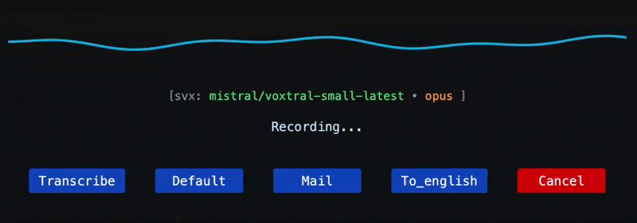

# supervoxtral



SuperVoxtral is a lightweight Python CLI/GUI utility for recording audio and processing it via a 2-step pipeline using Mistral's APIs.

The pipeline works in two stages: (1) **Transcription** — audio is converted to text using Voxtral's dedicated transcription endpoint (`voxtral-mini-latest`), which delivers fast inference, high accuracy across languages, and minimal API costs; (2) **Transformation** — the raw transcript is refined by a text-based LLM (e.g., `mistral-small-latest`) using a configurable prompt for tasks like error correction, summarization, or reformatting. In pure transcription mode (`--transcribe`), only step 1 is performed.

**Key features:**
- **Speaker diarization** — identifies who said what (enabled by default)
- **Auto-chunking** — long recordings (> 5 min) are automatically split, transcribed in parallel, and merged without duplicates
- **Dual audio capture** — records microphone + system audio (e.g., meeting participants on a call) when a loopback device is configured
- **Meeting-ready** — long recordings auto-save all files for data protection; use any prompt for meeting summaries, action items, etc.

For instance, use a prompt like: "_Transcribe this audio precisely and remove all minor speech hesitations: "um", "uh", "er", "euh", "ben", etc._"

The GUI is minimal, launches fast, and can be bound to a system hotkey. Upon stopping recording, it transcribes via the pipeline and copies the result directly to the system clipboard, enabling efficient voice-driven workflows: e.g., dictating code snippets into an IDE or prompting LLMs via audio without typing. Real-time segmented level meters (MIC, and LOOP when a loopback device is configured) give immediate feedback on audio signal, so you can confirm sound is being captured before committing to a recording.

## Requirements

- Python 3.11+
- ffmpeg (for MP3/Opus conversions)
  - macOS: `brew install ffmpeg`
  - Ubuntu/Debian: `sudo apt-get install ffmpeg`
  - Windows: https://ffmpeg.org/download.html

## Installation

The package is available on PyPI. We recommend using `uv` (a fast Python package installer) for a simple, global tool installation—no virtual environment setup required.


- For GUI support (includes PySide6):
  ```
  uv tool install "supervoxtral[gui]"
  # to update: uv tool update "supervoxtral[gui]"
  ```

- For core CLI only functionality:
  ```
  uv tool install supervoxtral
  ```

This installs the `svx` command globally. If you don't have `uv`, install it first via `curl -LsSf https://astral.sh/uv/install.sh | sh` (or from https://docs.astral.sh/uv/getting-started/installation/).

**Alternative: Using pip with a virtual environment**

If you prefer not to use uv, you can install via pip in a virtual environment:

1. Create and activate a virtual environment:

   - macOS/Linux:
     ```
     python -m venv .venv
     source .venv/bin/activate
     ```

   - Windows (PowerShell):
     ```
     python -m venv .venv
     .\.venv\Scripts\Activate.ps1
     ```

2. Install the package:

   For GUI support (includes PySide6):
   ```
   pip install "supervoxtral[gui]"
   ```

This installs the `svx` command within the virtual environment. Make sure to activate the environment before running `svx`.

**For development** (local editing):
1. Clone the repo and navigate to the project root.
2. Install dependencies (creates `.venv` automatically, editable mode, lockfile-based):
   ```
   uv sync --extra dev --extra gui
   ```
3. Run linting and type checking:
   ```
   uv run ruff check svx/
   uv run basedpyright svx
   ```

## Quick Start

To get started quickly with SuperVoxtral:

1. Initialize the configuration: `svx config init`
   This creates the default `config.toml` file with zero-footprint settings.

2. Open the configuration directory: `svx config open`
   Edit `config.toml` and add your [Mistral API key](https://console.mistral.ai/api-keys) under the `[providers.mistral]` section:
   ```
   [providers.mistral]
   api_key = "your_mistral_api_key_here"
   ```

3. Launch the GUI: `svx record --gui`
   This opens the minimal GUI and starts recording immediately. Real-time level meters (MIC / LOOP) confirm that audio is being captured. Click **Transcribe** for pure transcription (no prompt) or a button for each configured prompt (e.g., **Default**, **Mail**, **Translate**) for prompted transcription; results are copied to the clipboard automatically. (`--transcribe` is ignored in GUI mode with a warning.)

### macOS Shortcuts Integration

To enable fast, hotkey-driven access on macOS, integrate SuperVoxtral with the Shortcuts app. Create a new Shortcut that runs `svx record --gui` via a "Run Shell Script" action (ensure `svx` is in your PATH). Assign a global hotkey in Shortcuts settings for instant GUI launch—ideal for quick voice-to-text workflows, with results copied directly to the clipboard.

#### Quick Setup Steps
1. Open the Shortcuts app and create a new shortcut.
2. Add the "Run Shell Script" action with input: `svx record --gui`.
3. In shortcut details, set a keyboard shortcut (e.g., Cmd+Shift+V).


## Capturing system audio (loopback)

To record both your microphone and the audio playing on your computer (e.g., remote participants in a video call), you need a loopback audio device. The setup depends on your OS:

### macOS — BlackHole (free, open source)

1. Install BlackHole:
   ```
   brew install --cask blackhole-2ch
   ```
   (Restart may be required after install.)

2. Open **Audio MIDI Setup** (Spotlight → "Audio MIDI Setup").

3. Click `+` at the bottom left → **Create Multi-Output Device**.

4. Check your output device (e.g., "Headphones" or "External Speakers") — it must be **first** (clock source).

5. Check **BlackHole 2ch**.

6. Optionally rename it (e.g., "Headphones + BlackHole").

7. Set this Multi-Output Device as your system sound output (System Settings → Sound → Output).

8. In your `config.toml`:
   ```toml
   loopback_device = "BlackHole 2ch"
   ```

> **Note:** System volume control does not work with Multi-Output Devices (macOS limitation). Adjust volume in individual applications or in Audio MIDI Setup.

### Linux — PulseAudio monitor (built-in)

PulseAudio exposes a `.monitor` source for every output device. No additional software needed.

1. Find your monitor source name:
   ```
   pactl list sources short | grep monitor
   ```
   Example output: `alsa_output.pci-0000_00_1f.3.analog-stereo.monitor`

2. In your `config.toml`:
   ```toml
   loopback_device = "Monitor of Built-in Audio"
   ```
   (Use the name as shown by `pactl` or `sounddevice`.)

### Windows — WASAPI loopback (built-in)

Windows supports loopback capture natively via WASAPI since Vista.

1. The loopback device typically appears as "Stereo Mix" or similar in your sound settings. You may need to enable it:
   - Right-click the speaker icon → Sound Settings → More sound settings
   - Recording tab → right-click → Show Disabled Devices → Enable "Stereo Mix"

2. In your `config.toml`:
   ```toml
   loopback_device = "Stereo Mix"
   ```

### How it works

When `loopback_device` is configured, SuperVoxtral opens two audio inputs simultaneously (microphone + loopback) and mixes them into a single mono WAV file. You can adjust the relative volume of each source via `mic_gain` and `loopback_gain` in `config.toml` (default: 1.0 each).

When `loopback_device` is not set (default), only the microphone is recorded.

## Configuration (API keys and prompts)

API keys and default behavior are configured only in your user configuration file (config.toml), not via environment variables.

- Location of the user config:
  - macOS: ~/Library/Application Support/SuperVoxtral/config.toml
  - Linux: ${XDG_CONFIG_HOME:-~/.config}/supervoxtral/config.toml
  - Windows: %APPDATA%/SuperVoxtral/config.toml

- Initialize your user config and user prompt file:
  - `svx config init`: Creates config.toml (with sensible defaults, including zero-footprint mode) and a user prompt file at: `~/Library/Application Support/SuperVoxtral/` (macOS), `${XDG_CONFIG_HOME:-~/.config}/supervoxtral/` (Linux), or `%APPDATA%/SuperVoxtral/prompt/` (Windows).
  - `svx config open`: Opens the directory.
  - `svx config show`: Displays the current configuration.

Here's an example of the default `config.toml` generated by `svx config init`:

```toml
# SuperVoxtral - User configuration
#
# Basics:
# - This configuration controls the default behavior of `svx record`.
# - The parameters below override the binary's built-in defaults.
# - You can override a few options at runtime via the CLI:
#   --prompt / --prompt-file (set a one-off prompt for this run)
#   --log-level (debugging)
#   --outfile-prefix (one-off output naming)
#
# Output persistence:
# - Set keep_* = true to create and save files to project
#   directories (recordings/, transcripts/, logs/).
# - false (default): use temp files/console only (no disk
#   footprint in project dir).
#
# Authentication:
# - API keys are defined in provider-specific sections in this file.
[providers.mistral]
# api_key = ""

[defaults]
# Provider to use (currently supported: "mistral")
provider = "mistral"

# File format sent to the provider: "wav" | "mp3" | "opus"
# Recording is always WAV; conversion is applied if "mp3" or "opus"
format = "opus"

# Model for audio transcription (dedicated endpoint)
model = "voxtral-mini-latest"

# Model for text transformation via LLM (applied after transcription when a prompt is used)
chat_model = "mistral-small-latest"

# Language hint (may help the provider)
language = "fr"

# Context bias: up to 100 words/phrases to help recognize specific vocabulary
# (proper nouns, technical terms, brand names, etc.)
# context_bias = ["SuperVoxtral", "Mistral AI", "Voxtral"]
context_bias = []

# Speaker diarization (identify speakers in transcription)
diarize = true

# Auto-chunking for long recordings (seconds)
# Recordings longer than chunk_duration are split into overlapping chunks
chunk_duration = 300   # 5 minutes
chunk_overlap = 30     # 30s overlap between chunks

# Loopback device for dual audio capture (mic + system audio)
# See "Capturing system audio" section for setup instructions
# loopback_device = "BlackHole 2ch"

# Audio recording parameters
rate = 16000
channels = 1
#device = ""

# Output persistence:
# - keep_audio_files: false uses temp files (no recordings/ dir),
#   true saves to recordings/
keep_audio_files = false
# - keep_transcript_files: false prints/copies only (no
#   transcripts/ dir), true saves to transcripts/
keep_transcript_files = false
# - keep_log_files: false console only (no logs/ dir), true
#   saves to logs/app.log
keep_log_files = false

# Automatically copy the transcribed text to the system clipboard
copy = true

# Log level: "DEBUG" | "INFO" | "WARNING" | "ERROR"
log_level = "INFO"

[prompt.default]
# Default user prompt source:
# - Option 1: Use a file (recommended)
file = "~/.config/supervoxtral/prompt/user.md"
#
# - Option 2: Inline prompt (less recommended for long text)
# text = "Please transcribe the audio and provide a concise summary in French."

[prompt.test]
# Example additional prompt
# file = "/path/to/another_prompt.md"
# text = "Summarize the meeting in bullet points."
```

**Configuration is centralized via a structured `Config` object loaded from your user configuration file (`config.toml`). CLI arguments override select values (e.g., prompt, log level), but most defaults (provider, model, keep flags) come from `config.toml`. No environment variables are used for API keys or settings.**

No `.env` or shell environment variables are used for API keys.


## Usage (CLI)

The CLI provides config utilities and a unified `record` entrypoint for both CLI and GUI modes, using a centralized pipeline for consistent behavior (recording, conversion, transcription, saving, clipboard copy, logging).

**Zero-footprint defaults**: No directories created; outputs to console/clipboard. Use `--save-all` or set `keep_* = true` in config.toml to persist files to user data directories (e.g., `~/Library/Application Support/SuperVoxtral/` on macOS). Long recordings (> chunk_duration) automatically enable persistence for data protection.

Most defaults (provider, format, model, language, rate, channels, device, keep flags, copy) come from config.toml. CLI overrides are limited to specific options.

### Record Command

```
svx record [OPTIONS]
```

**Options**:
- `--user-prompt TEXT` (or `--prompt TEXT`): Inline user prompt for this run.
- `--user-prompt-file PATH` (or `--prompt-file PATH`): Path to a markdown file with the user prompt.
- `--transcribe`: Enable pure transcription mode (ignores prompts; uses dedicated endpoint).
- `--outfile-prefix PREFIX`: Custom prefix for output files (default: timestamp).
- `--gui`: Launch the GUI frontend. Recording starts immediately; real-time level meters (MIC / LOOP) confirm signal. Buttons: **Transcribe** (pure transcription, no prompt) or one button per configured prompt key (e.g., **Default**). Respects config.toml and other CLI flags (e.g., `--save-all`). `--transcribe` is ignored with a warning in GUI mode.
- `--save-all`: Override config to keep audio, transcripts, and logs for this run.
- `--log-level LEVEL`: Set logging level (DEBUG, INFO, WARNING, ERROR; default: INFO).

**Examples**:
- Record with prompt: `svx record --prompt "What's in this audio?"`
  - Records WAV, converts if needed, sends to provider with prompt, outputs to console/clipboard.
- Persist outputs: `svx record --save-all --prompt "Summarize this"`
  - Saves to recordings/, transcripts/, logs/.
- Transcribe only: `svx record --transcribe`
  - No prompt; direct transcription. Add `--save-all` to persist.
- Launch GUI: `svx record --gui`
  - Interactive mode: recording starts immediately; click 'Transcribe' (pure transcription, no prompt) or 'Prompt' (with resolved prompt); --transcribe ignored with warning. GUI respects config.toml and CLI flags (e.g., `--gui --save-all`).

**Prompt Resolution Priority** (for non-transcribe mode):
By default in CLI, uses the 'default' prompt from config.toml [prompt.default]. For overrides:
1. CLI `--user-prompt` or `--user-prompt-file`
2. Specified prompt key (future: via --prompt-key; currently implicit 'default')
3. config.toml [prompt.default] (text or file)
4. User prompt file (user.md in config dir)
5. Fallback: "What's in this audio?"

## Changelog

- 0.5.0: GUI improvements — replace decorative waveform with real-time segmented LED-style audio level meters (MIC always visible, LOOP shown when a loopback device is configured), giving immediate feedback on whether signal is present before committing to a recording; redesigned info bar now shows `model`, `llm`, `audio format` and `lang` fields explicitly (avoids confusion between the Opus audio codec and the Anthropic Opus model); added window title.
- 0.4.2: Fix audio saturation and distortion — record at device native sample rate (typically 48 kHz) instead of 16 kHz to eliminate PortAudio resampling artifacts; switch to float32 capture pipeline to avoid int16 clipping during format conversion. Remove 0.5 averaging factor in dual recording mix (meeting use case: sources are mutually exclusive, averaging unnecessarily halves the signal level).
- 0.4.1: Fix dual audio mix attenuation — removed unnecessary 0.5 factor that was halving mic volume when loopback was silent; `np.clip` already prevents int16 overflow. Refactored mixing logic into a `_mix_and_write` helper.
- 0.4.0: Meeting recording support — speaker diarization (enabled by default), auto-chunking for long recordings (> 5 min) with overlap and segment deduplication, dual audio capture (mic + system loopback with configurable per-source gain). User data files now stored in platform-standard directories instead of cwd. Long recordings auto-save all files for data protection.
- 0.3.0: Add `context_bias` support for Mistral Voxtral transcription — a list of up to 100 words/phrases to help the model recognize specific vocabulary (proper nouns, technical terms, brand names). Configurable in `config.toml` under `[defaults]`.
- 0.2.0: 2-step pipeline (transcription → transformation). Replaces chat-with-audio by dedicated transcription endpoint + text-based LLM. New `chat_model` config option. Raw transcript saved separately when transformation is applied.
- 0.1.5: Fix bug on prompt selecting
- 0.1.4: Support for multiple prompts in config.toml with dynamic GUI buttons for each prompt key
- 0.1.3: Minor style update
- 0.1.2: Interactive mode in GUI (choose transcribe / prompt / cancel while recording)
- 0.1.1: Minor updates to default config and default prompt

## License

MIT
